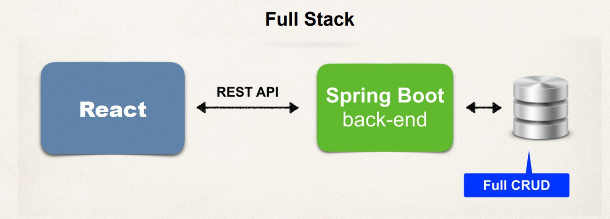

# OBJECTIFS
==

+ Créez une application Full Stack - React et Java Spring Boot, Stripe Credit Card Payments, Spring Security, JWT, Spring Data JPA

# React - Page d'accueil

### React Frontend
• Créer des composants React Front End
• Récupérer des données à partir des API REST Spring Boot

### Processus de développement
1. Créer un projet React + TypeScript
2. Ajoutez Bootstrap et CSS
3. Créer un composant de barre de navigation React
4. Créer le composant React Explore Top Books
5. Créer un carrousel React pour le composant Livres
6. Créez le composant du héros React
7. Créer un composant de services de bibliothèque React
8. Créer un composant de pied de page React

### Étape 1 : Créer un projet React
• Créez un nouveau projet à l'aide de la commande React + TypeScript.

### Étape 2 : ajouter Bootstrap et CSS
• Intégrez les `CSS` et `JS` de Bootstrap à notre application.

#### Étape 3 : Créer un composant de barre de navigation React
• Créez un nouveau composant `.tsx` qui sera en haut de chaque page

#### Étape 4 : Créer un composant React Explore Books
• Créez un nouveau composant `.tsx` qui sera affiché comme premier composant sur la page d'accueil.

### Étape 5 : Créer un composant React Carrousel
• Créez un nouveau composant `.tsx` qui permettra à l'utilisateur de voir les livres sur la page d'accueil.

### Étape 6 : Créer un composant React Hero
• Créez un nouveau composant `.tsx` qui fournira des informations à l'utilisateur ainsi qu'une image

### Étape 7 : Créer des services de bibliothèque React
• Créer un nouveau composant `.tsx` qui redirigera un utilisateur vers les services de la bibliothèque

### Étape 8 : Créer un composant de pied de page React
• Créez un nouveau composant `.tsx` qui sera au bas de chaque page

# Spring Boot Back End

### Environnement de développement Java
• Nous supposons que vous êtes déjà un développeur Spring Boot expérimenté.
• Vous devriez avoir les éléments suivants déjà installés
• Kit de développement Java (JDK)
• IDE Java (nous utiliserons IntelliJ dans les vidéos, mais n'importe quel IDE Java fonctionnera)
• Maven
• Base de données MySQL et MySQL Workbench

### À propos d'IntelliJ
• Dans ce cours, nous utiliserons la version gratuite d'IntelliJ
• Connu sous le nom d'IntelliJ Community Edition
• Téléchargez depuis : https://www.jetbrains.com/idea/download
• Sélectionnez l'édition communautaire.
• Vous pouvez également utiliser l'Ultimate Edition ($)... une version d'essai gratuite est disponible

### IDE Java supplémentaires
• Vous êtes libre d'utiliser d'autres IDE Java tels que Eclipse, VS Code, NetBeans
• Tout ce dont vous avez besoin est un IDE Java prenant en charge Maven... c'est tout !
• Vous pouvez facilement suivre n'importe quel IDE Java
• Nous fournirons un support technique pour IntelliJ, Eclipse, VS Code, NetBeans

### Spring Boot Back End
• Tirer parti de Spring Data REST pour l'API REST
• Minimise le codage pour le back-end Spring Boot

### Créer un référentiel
• Spring Data REST analysera votre projet pour JpaRepository
• Exposer les API REST pour chaque type d'entité pour votre JpaRepository

### Points de terminaison REST
• Par défaut, Spring Data REST créera des points de terminaison en fonction du type d'entité.
• Forme pluralisée simple
• Le premier caractère du type d'entité est en minuscule.
• Ensuite, il suffit d'ajouter un « s » à l'entité.

### API REST

• Spring Data REST exposera ces points de terminaison gratuitement !

### Cinq scripts de base de données

• React-Springboot-Add-Tables-Script-1.sql
• React-SpringBoot-Add-Books-Script-2.sql
• React-SpringBoot-Add-Books-Script-3.sql
• React-SpringBoot-Add-Books-Script-4.sql
• React-SpringBoot-Add-Books-Script-5.sql

### Utilisateur MySQL pour notre application
1. Créez un nouvel utilisateur MySQL pour notre application

+ identifiant utilisateur : root
+ mot de passe : test1234 !

### À propos de : React-Springboot-Add-Tables-Script-1.sql
1. Crée de nouvelles tables pour notre base de données MySQL

+ Book
+ Checkout
+ History
+ Messages
+ Reviews

### React-Springboot-Add-Books-Script-(2-5).sql
1. Ajoutez des livres à notre base de données
2. Les livres contiennent des blobs pour les images qui nécessitent beaucoup de mémoire
3. Les livres sont répartis en 4 fichiers

### Back-end de démarrage à ressort

### Processus de développement
1. Configurer les tables de la base de données
2. Créez un projet de démarrage Spring Boot (start.spring.io)
3. Développer l'entité : réserver
4. Créez des API REST avec les référentiels Spring Data JPA et Spring Data REST

### Projet Lombok
• Projet Java moderne
• Lombok génère automatiquement les getters/setters (en coulisses)
• Pas besoin pour le développeur de définir manuellement les getters/setters, etc...
• Annotations faciles à utiliser pour éliminer le code passe-partout

# Consommer l'API du livre carrousel

### API REST
• Nous devons maintenant récupérer nos API Livres pour que les livres alimentent notre carrousel.

### React Frontend
• Créer des composants React Front End
• Récupérer des données à partir des API REST Spring Boot

### Appel de l'API Spring Boot à partir de l'application React
• Fonctionnalité de récupération JavaScript

# React - Composant de recherche de livres

### Composant Rechercher des livres
• L'utilisateur verra les livres affichés avec leurs informations

### Composant Rechercher des livres
• Afficher toutes les informations sur le livre

### Composant Rechercher des livres
• Deux composants TypeScript

### Composant Rechercher des livres
• Un composant supplémentaire
• Avoir une pagination au bas de chaque page de résultats de recherche

# Pagination

• La pagination est utile pour gérer de grandes quantités de données
• Montrer aux utilisateurs un petit sous-ensemble de données : "page" de données
• L'utilisateur peut cliquer sur des liens pour afficher d'autres pages

### Concepts de pagination

### Pagination
• Nous aurons besoin d'un support de pagination sur le back-end : Spring Boot
• Nécessite également une prise en charge de la pagination sur le front-end : React

### Pagination
• Notre backend Spring Boot utilise Spring Data REST
• Spring Data REST fournit un support de pagination prêt à l'emploi... oui !!!

### Données de printemps REST - Paramètres
• Par défaut, Spring Data REST renvoie : 20 éléments
• Nous pouvons personnaliser cela en passant des paramètres

|Paramètre | But| 
|----------|----|
|page |Le numéro de la page à laquelle accéder. Basé sur 0... la valeur par défaut est 0.|
|size |La taille de la page à renvoyer (éléments par page). La valeur par défaut est 20|

### Spring Data REST - Exemples de pagination
• Obtenez la première page, avec une taille de page de 10.
• Obtenez la deuxième page, avec une taille de page de 10.

### Spring Data REST - Métadonnées de réponse
• Les métadonnées de réponse contiennent des informations précieuses

### Pagination avec React
• Exemple de base de composant de pagination
• Créer un nouveau composant Pagination que nous pouvons réutiliser dans notre application
