# React and Spring Boot


### **Objectif du cours**

+ Créer une application Full-Stack avec `React` et `Spring Boot`.

### **Conditions préalables**

+ Vous devez avoir une expérience préalable avec
    + **Java**
    + **Spring Boot**
    + **Maven**

• AUCUNE expérience préalable n'est nécessaire pour React

• Nous vous apprendrons React dès le début :-)

• Pas une couverture A-Z de React… mais suffisamment pour créer des applications Full-Stack

### **Feuille de route du cours**

• Présentation de React

• Mettre en place un environnement de développement

• Cours accéléré de react

• Cours accéléré sur `TypeScript`

• Créer une application en temps 
réel

• Créer une interface React

• Développer le back-end de Spring Boot

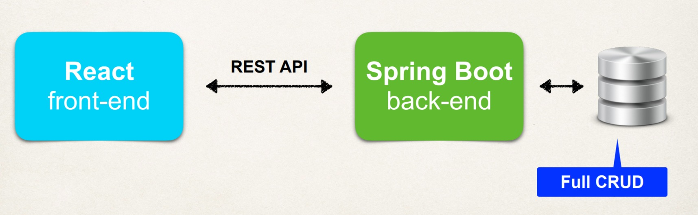


## **Qu’est-ce que React ?**

• `React` est une bibliothèque permettant de créer des applications modernes d'une seule page.

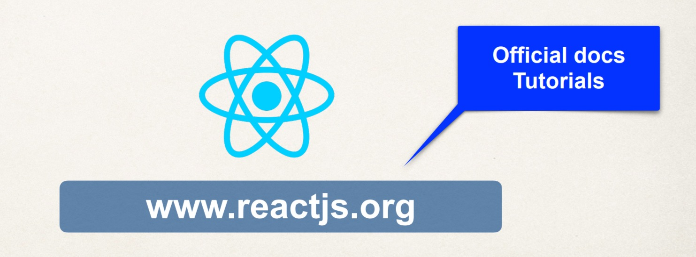

<span style="color : red">En quoi l’application monopage est-elle différente de l’application traditionnelle ?</span>


### **Application traditionnelle**
• Chaque action de l'utilisateur entraîne le chargement complet d'une page `HTML`.

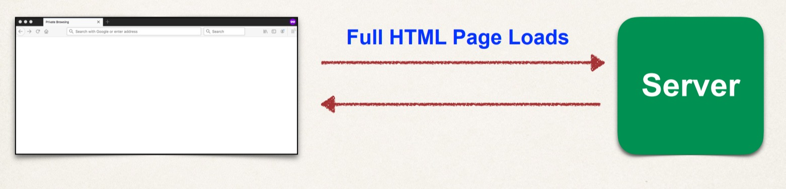

### **Demande d'une seule page**

+ Une application Web composée d'une seule page
+ En fonction des actions de l'utilisateur, la page de l'application est mise à jour.
+ Effectue normalement une mise à jour partielle… au lieu d'un chargement complet de la page

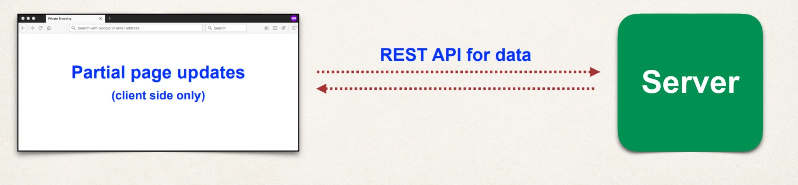

### Exemples d'applications d'une seule page

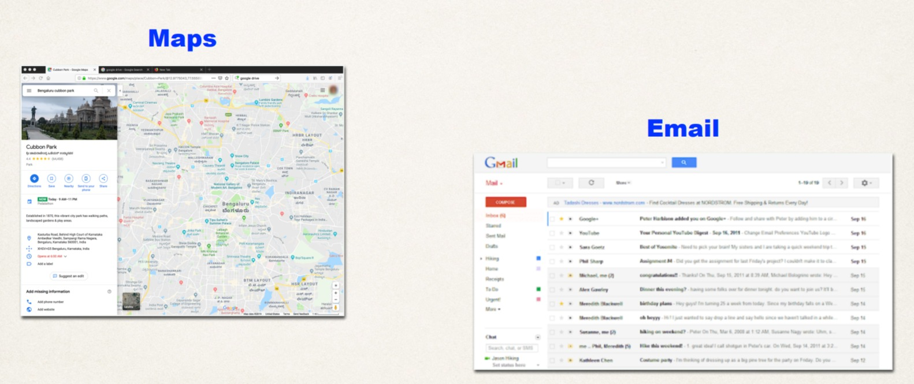

### Solution de réaction
+ `React` est une bibliothèque permettant de créer des applications modernes d'une seule page.

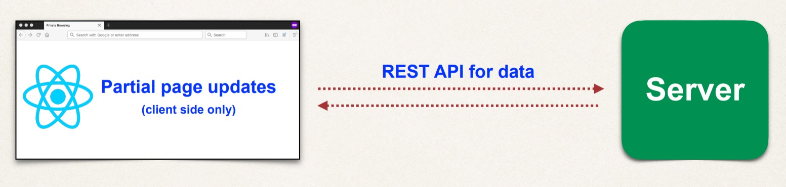

### Qui utilise React
+ Des entreprises du monde entier utilisent React

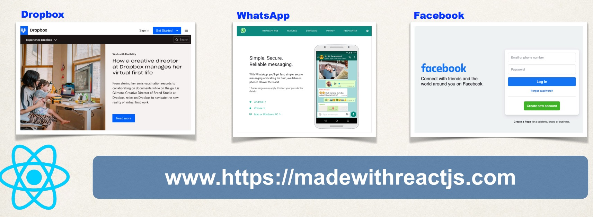

### Historique de React

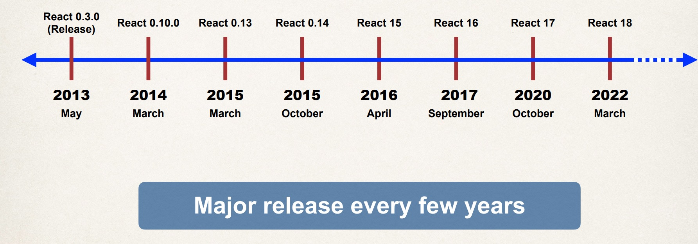

## Configurer l'environnement de développement

### Outils de développement React
+ Vous pouvez utiliser n'importe quel éditeur de texte ou IDE
+ De nombreux développeurs `React` utilisent le langage `TypeScript` plutôt que `JavaScript`.
    +  Sur-ensemble de JavaScript
    + Langage fortement typé avec vérification au moment de la compilation et prise en charge de l'IDE
+ Outils de ligne de commande pour compiler du code et créer des applications/composants React

### Code de Visual Studio
+ `IDE` gratuit prenant en charge plusieurs langages de programmation
+ Possède une prise en charge intégrée pour `TypeScript` et `JavaScript`
+ Fonctionnalités IDE telles qu'IntelliSense, Débogage, etc…

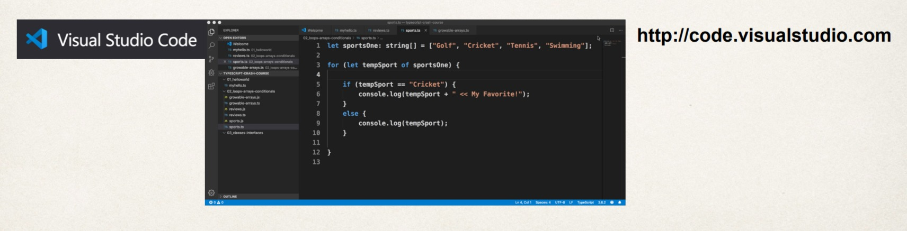

### Outils de ligne de commande

|Outil |But|
|------|---|
|`node`|Pour exécuter du code JavaScript à partir de la ligne de commande|
|`npm` | Gestionnaire de packages de `Node` <br/> - Téléchargez de nouveaux packages et fonctionnalités de `Node`. Semblable à `Maven`| 
| `tsc` | Compilateur `TypeScript` |

### instructions d'installation
+ Outils d'installation : Visual Studio Code, node, npm, tsc
+ Instructions étape par étape pour chaque système d'exploitation
+ Consultez les instructions sur le lien suivant

<span style="color : red">www.luv2code.com/react-install-guides</span>

## React - Commençons

### React
+ `React` est un framework permettant de créer des applications modernes d'une seule page.

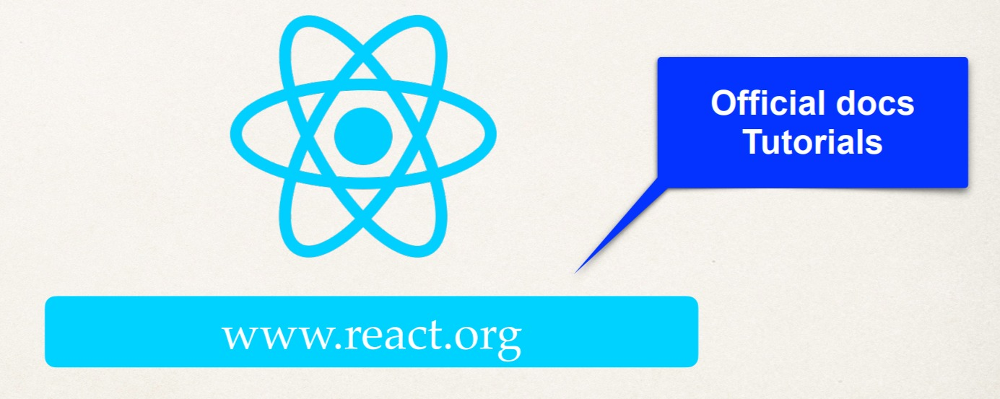

### Fonctionnalités de React
+ Cadre basé sur les composants
+ Vues déclaratives
+ La logique des composants est écrite avec JavaScript
+ Prend en charge la conception Web réactive et les cadres modernes
    + Bootstrap, Google Material Design et autres…

### Architecture de React

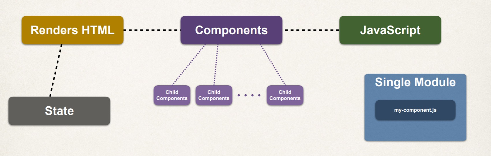

### Mots clés

|Terme | Définition| 
|------|-----------|
| `Component` | Acteur principal d'une application React. Comporte deux parties : <br/> 1. Afficher l'interface utilisateur <br/> 2. JavaScript qui contient la logique d'application/la gestion des événements pour la vue
|`Props`| Comment nous transmettrons les données d'un composant parent à un composant enfant |
|`State`| Contient des données sur le composant. <br/> Lorsque l'état change, le composant sera restitué.|
|`Hooks` | Un moyen d'utiliser l'état local et d'autres fonctionnalités de React sans écrire de nouvelle classe|
|`Module` |Une collection de composants associés, qui créent une vue spécifique.|

### Composition de l'interface utilisateur de l'application

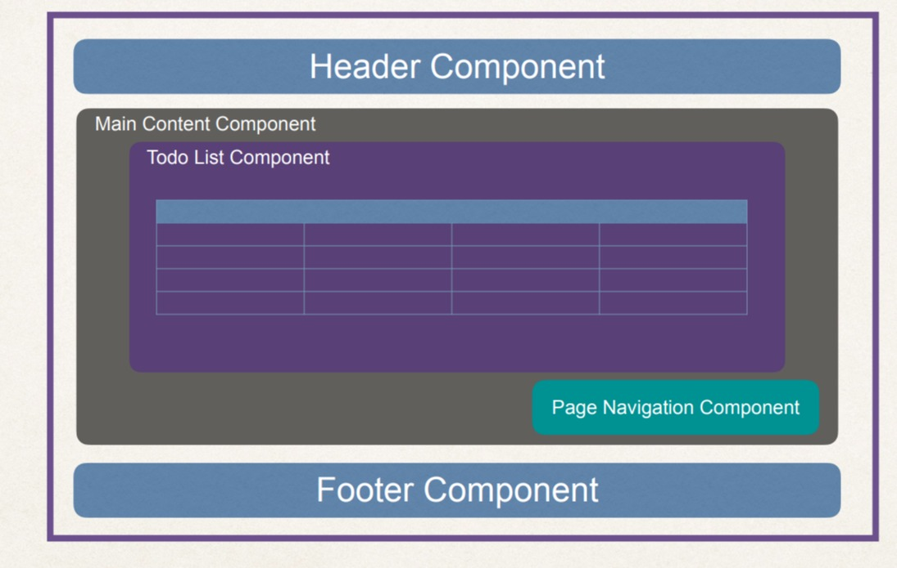

### Interaction avec les applications

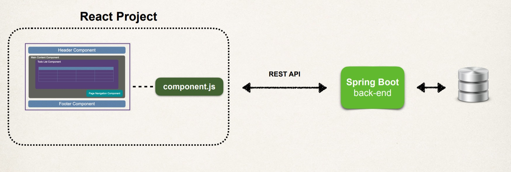

### Projet React
+ Un projet `React` est composé de plusieurs fichiers

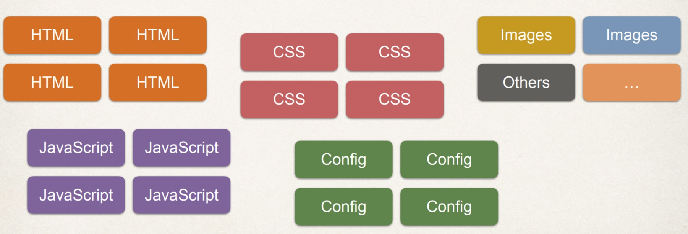

### Créer un projet React
+ `React` fournit un outil en ligne de commande pour générer un projet
+ Génère les fichiers de démarrage pour vous aider à démarrer votre projet

<span style="color:blue">Créer une application React est facile</span>


### Création d'une nouvelle application React

```
    > npx create-react-app my-app
```

### Exécuter votre nouvelle application React

```
    > cd my-app
    > npm start
```

### Création d'une nouvelle application React

```
    > npx create-react-app my-app
```

### Exécuter votre nouvelle application React

```
    > cd my-app
    > npm start
```

### Changer le port du serveur

```
    > set PORT=5100 && npm start
```


### React
+ Lorsque nous exécutons l'application React... comment est-elle chargée ?

### Chargement de l'application React

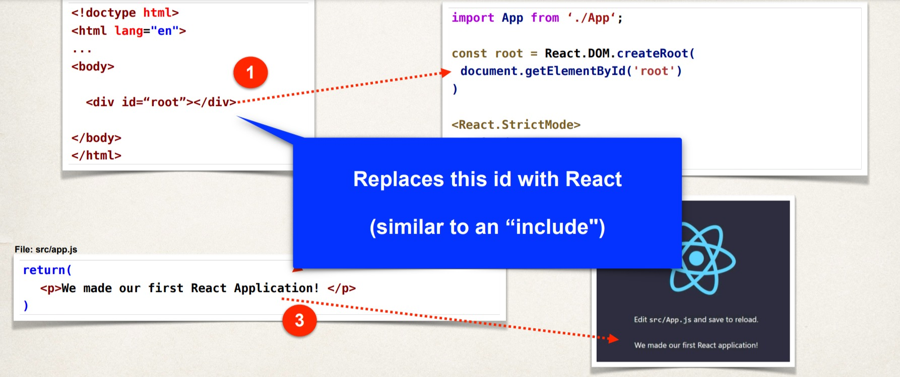


### Project React : TODO ITEM

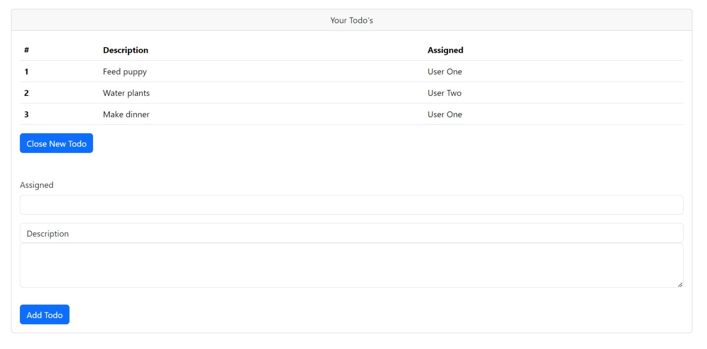