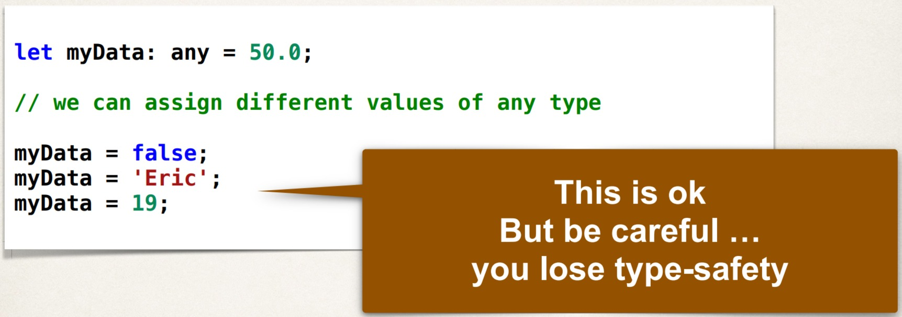
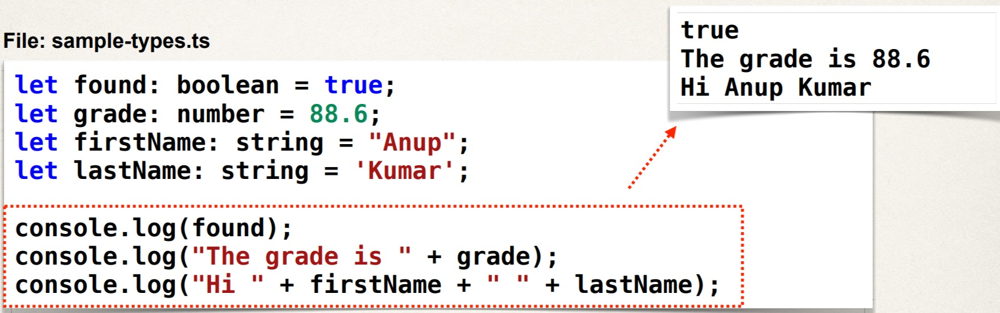

# Bases de TypeScript

## Qu’est-ce que TypeScript ?
+ Langage développé par Microsoft en 2012
    +  Gratuit et open source
+  Fournit une prise en charge de la saisie statique pour JavaScript
    +  Aide à la prise en charge de l'IDE : complétion du code et débogage
+  Ajout de la prise en charge de la programmation orientée objet
    +  Classes, objets, héritage, interfaces, etc…

## Développement de réaction
+ Pour le développement `React`, nous pouvons développer en utilisant différents langages
    + `JavaScript` : langage de programmation extrêmement populaire
    + `ECMAScript` : version standardisée de JavaScript (ES6, ES9, …)
    + `TypeScript` : ajoute des types facultatifs à JavaScript
    + D'autres langages tels que `Dart`, etc

+ **TypeScript** est le langage le plus populaire pour le développement de React

## Des relations
+ **TypeScript** est un surensemble de **JavaScript** et **ECMAScript**.

## Manuscrit
+  FAQ : Pourquoi la plupart des développeurs React utilisent-ils TypeScript ?
    +  Langage fortement typé avec vérification du moment de la compilation et prise en charge de l'IDE
    +  Augmentation de la productivité et de l'efficacité des développeurs

## Résultats pratiques
+ Introduction au développement TypeScript
+ Il ne s'agit pas d'une référence de A à Z
+ Pour une référence complète, consultez <a href="https://www.typescriptlang.org">la documentation TypeScript</a>.

## Processus de développement
1. Créer du code TypeScript
2. Compilez le code
3. Exécutez le code

## Étape 1 : Créer le code TypeScript
+ Les fichiers TypeScript portent l'extension `.ts`.

## Étape 2 : compiler le code
+ Les navigateurs Web ne comprennent pas TypeScript de manière native.
+  Vous devez convertir le code TypeScript en code JavaScript
+ C'est ce qu'on appelle le « transpilage ».

## Étape 2 : Compiler le code (suite)
+ Le "transpilage" s'effectue avec la commande `tsc`

## Étape 3 : Exécutez le code
+ Pour exécuter le code JavaScript, nous utilisons la commande node
+ Exécutez le code JavaScript généré (fichier .js)

## Le compilateur est votre ami
+ Le compilateur/IDE peut trouver les erreurs plus tôt au moment de la compilation

## Variables TypeScript

### 1) Types de base

|Type |Description|
|-----|-----------|
|`boolean`|valeurs vraies/fausses|
|`number`|Prend en charge les nombres entiers et à virgule flottante|
|`string`|Données texte. Mis entre guillemets simples ou doubles|
|`any`|Prend en charge "n'importe quelle" affectation de type de données|
|`Others...`|Voir les détails sur <u>www.typescriptlang.org</u>|

### 2) Définir des variables

### 3) Exemples

### 4) TypeScript : mot-clé "let"
+ Nous utilisons le nouveau mot-clé TypeScript `let` pour les déclarations de variables
    + Contrairement à l'utilisation du mot-clé `var` JavaScript traditionnel.
+ Le mot-clé JavaScript `var` présentait un certain nombre de pièges et de pièges.
    + Cadrage, capture, observation, etc.
+ Le nouveau mot-clé TypeScript `let` permet d'éliminer ces problèmes.

### 5) TypeScript est fortement typé

### 6) Type : any

### Affichage de la sortie

### Exécutez l'application

### Chaînes de modèle

